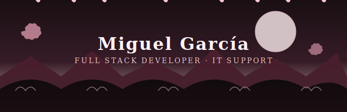

<!-- ============ BANNER ORIENTAL SAKURA (SVG propio, animado) ============ -->

 

<!-- ============ SOBRE MÍ ============ -->
## 👋 Sobre mí

- 🔭 Desarrollo sitios y aplicaciones web **full stack con JavaScript** (front y back), HTML y CSS, para clientes del sector **tecnología y seguridad**
- 🛠️ También doy soporte técnico: diagnóstico de hardware, administración de sistemas (Windows / Linux) y redes
- 🌱 Aprendiendo y reforzando **ERP (Odoo)**, control de versiones y buenas prácticas de desarrollo
- 💬 Pregúntame sobre JavaScript (Node, front-end), troubleshooting de IT o configuración de servidores
- 📍 Querétaro, México
- ⚡ Fun fact: paso del código a un cable de red sin pestañear

 

<!-- ============ STATS DE GITHUB ============ -->
## 📊 Mis estadísticas

 

<!-- ============ TECNOLOGÍAS ============ -->
## 🧰 Tecnologías y herramientas

  

  

 

<!-- ============ GRÁFICA DE ACTIVIDAD ANIMADA ============ -->
## 📈 Mi actividad de contribuciones

 

<!-- ============ RESUMEN (elemento gráfico extra) ============ -->
## 🏆 Resumen

 

<!-- ============ CONTADOR DE VISITAS (elemento gráfico extra) ============ -->

<!-- ============ FOOTER ============ -->

✨ *Gracias por visitar mi perfil* ✨

